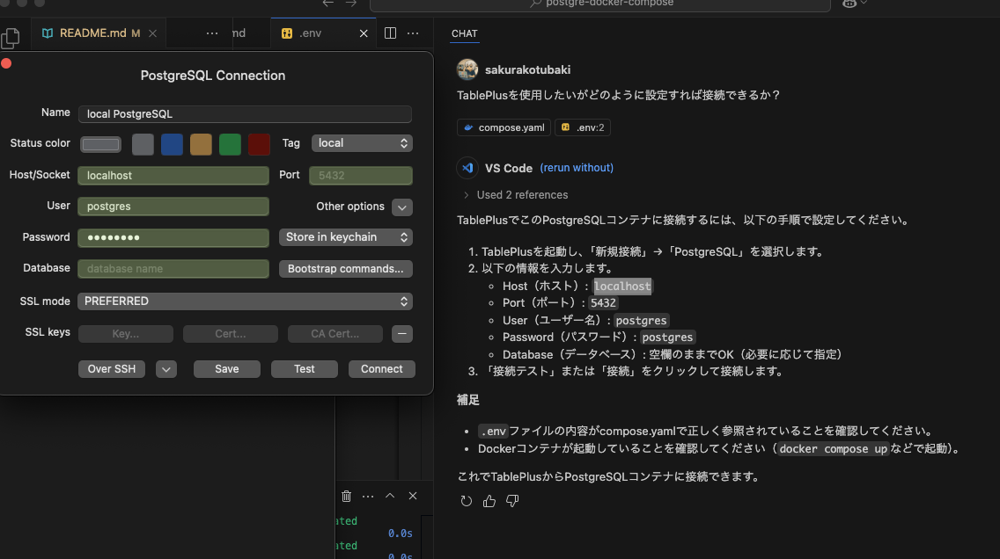
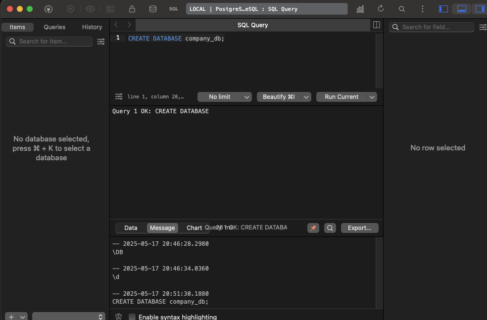

# postgre-docker-compose
docker-composeを使用して、PostgreSQLの環境構築をする

[zenn](https://zenn.dev/joo_hashi/articles/3702238384488f)の記事のバージョンを編集して使用する。

[🔗DockerHubのリンク](https://hub.docker.com/_/postgres)

1. `.env`ファイルを作成し、以下の内容で環境変数を設定する  
※このファイルがないと `docker compose up -d` 実行時にエラーになります。

```shell
touch .env
```

```
POSTGRES_VERSION=16.9
CONTAINER_NAME=company_db # お好きに
HOSTNAME=pgsql-db # お好きに
USER_NAME=postgres # ユーザー名
USER_PASS=postgres # パスワード
```

2. `compose.yaml`を作成する。

```shell
touch compose.yaml
```

```yml
services:
  pgsql_db:
    image: postgres:${POSTGRES_VERSION}
    container_name: ${CONTAINER_NAME}
    hostname: ${HOSTNAME}
    ports:
      - "5432:5432"
    restart: always
    environment:
      - POSTGRES_USER=${USER_NAME}
      - POSTGRES_PASSWORD=${USER_PASS}
    volumes:
      - db_vol:/var/lib/postgresql/data

volumes:
  db_vol:
```

3. コンテナを起動する  
※必ず `.env` ファイルを作成し、必要な変数を設定してから実行してください。

```shell
docker compose up -d
```

4. コンテナを削除する
```shell
docker compose down
```

5. TablePlusに接続する。他のツールでも良い。



[こちらのサイトを参照](https://envader.plus/article/119#%E3%83%87%E3%83%BC%E3%82%BF%E3%83%99%E3%83%BC%E3%82%B9%E3%81%B8%E3%81%AE%E6%8E%A5%E7%B6%9A)

アプリを開いて右クリックして、New -> Connection

6. データベースを作成する。

```shell
CREATE DATABASE company_db;
```

成功するとこのようなlogが表示される。



SQLのクエリを実行する。create -> insert -> select

```sql
-- `employees` テーブルが存在する場合は削除する
DROP TABLE IF EXISTS employees;

-- 新しく `employees` テーブルを作成
CREATE TABLE employees (
    id SERIAL PRIMARY KEY,  -- 従業員ID (自動採番)
    name TEXT NOT NULL,     -- 従業員名
    position TEXT, -- 役職
    salary INTEGER -- 給与
);

-- 初期データを挿入
INSERT INTO employees (id, name, position, salary) VALUES
(1, 'Tanaka', 'Manager', 5000),
(2, 'Suzuki', 'Developer', 4000),
(3, 'Yamada', 'Designer', 3500);

SELECT * FROM employees;
```


## コマンドラインで起動する場合
1. VSCocde Dockerのアイコンをクリック
2. PostgreSQLコンテナを右クリック
3. Attach Shellをクリック
4. ターミナルが起動する
USER_NAME=postgres # ユーザー名
5. psql -U postgresを入力

```sql
psql -U postgres
```

データベースとテーブルを作成している場合
```sql
\c company_db
```

```sql
CREATE DATABASE company_db;
```

```sql
CREATE TABLE employees (
    employee_id SERIAL PRIMARY KEY,
    name TEXT NOT NULL,
    age INTEGER,
    position TEXT
);
```

```sh
\d employees;
```

```sql
You are now connected to database "company_db" as user "postgres".
company_db=# \d employees;
                                   Table "public.employees"
   Column    |  Type   | Collation | Nullable |                    Default                     
-------------+---------+-----------+----------+------------------------------------------------
 employee_id | integer |           | not null | nextval('employees_employee_id_seq'::regclass)
 name        | text    |           | not null | 
 age         | integer |           |          | 
 position    | text    |           |          | 
Indexes:
    "employees_pkey" PRIMARY KEY, btree (employee_id)

company_db=# history
```